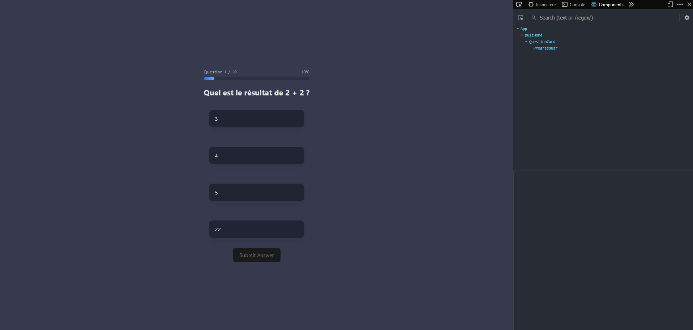
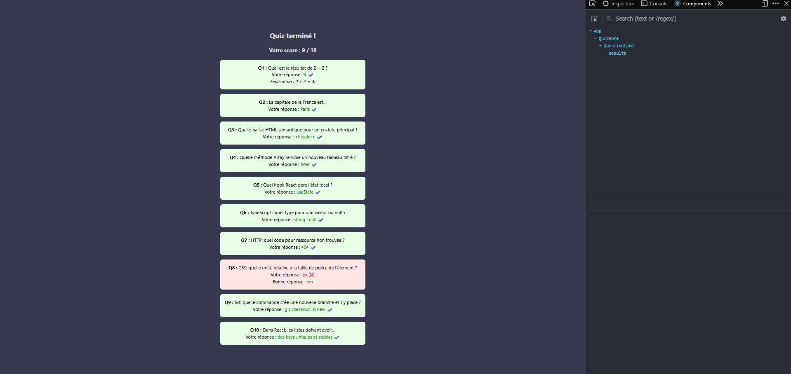
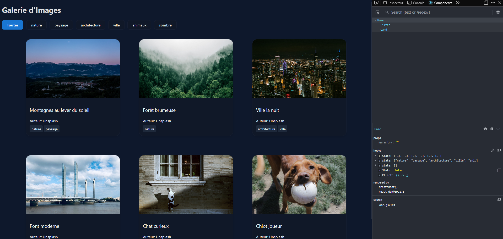
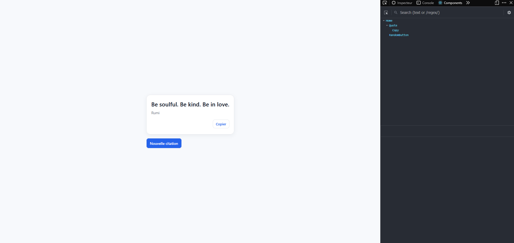

# 📘 ReactJS - Cours

## 📅 Période de cours : 15/09/2025 → 19/09/2025

Ce repository regroupe les exercices réalisés dans le cadre de l’apprentissage de **ReactJS**. Chaque exercice possède son propre dossier et code source.

---

## 🚀 Exercice 1 – Quiz Interactif

### 🎯 Objectif

Un quiz interactif développé avec **React + Vite**, permettant :

* d’afficher des questions à choix multiples,
* de sélectionner une réponse,
* de calculer un score,
* de voir le résultat final avec un récapitulatif.

### 🛠️ Concepts abordés

* **Gestion du state** avec `useState` (questions, réponse sélectionnée, score).
* **Composition de composants** et passage de `props`.
* **Rendu conditionnel** (affichage de la question, de l’écran de résultat, du récapitulatif).
* **Itération et rendu de listes** (`Array.map`) avec gestion correcte des `key`.

### ✨ Aperçu visuel





---

## 🚀 Exercice 2 – Galerie d’Images avec Filtres

### 🎯 Objectif

Développer une application **React** qui affiche une **galerie d’images** avec des filtres de catégories.

### 🛠️ Concepts abordés

* Simulation d’un **chargement asynchrone**.
* Gestion d’un **état de filtre** (catégorie sélectionnée).
* Affichage d’**états conditionnels** :

  * chargement,
  * erreur,
  * aucun résultat.
 
### ✨ Aperçu visuel




## 🚀 Exercice 3 – Générateur de citations aléatoires

### 🎯 Objectif

Développer une petite application **React** qui permet :

* d’afficher une **citation aléatoire**,
* de générer une **nouvelle citation**,
* et de **copier la citation** dans le presse-papiers.

### 🛠️ Concepts abordés

* Utilisation de **fetch** avec une API publique ([DummyJSON](https://dummyjson.com/quotes/random)).
* Création d’un **hook personnalisé** pour gérer la copie dans le presse-papiers.
* Manipulation du state et des hooks React.

### 🌍 API utilisée

* **Citation aléatoire :** [https://dummyjson.com/quotes/random](https://dummyjson.com/quotes/random)

### ✨ Aperçu visuel



---

## ⚙️ Installation & exécution

### 1️⃣ Cloner le projet

```bash
git clone https://github.com/AxelDemeyere/ReactJS-Cours.git
cd exo3
```

### 2️⃣ Installer les dépendances

```bash
npm install
```

### 3️⃣ Lancer le serveur de développement

```bash
npm run dev
```

---

## 📦 Technologies utilisées

* [React 19](https://react.dev/) ⚛️
* [Vite 7](https://vitejs.dev/) ⚡
* [Axios](https://axios-http.com/) 🌐
* ESLint pour le linting 🔍

---

## 📚 Autres exercices

* *Exercice 1 : ...*
* *Exercice 2 : Galerie d’Images avec Filtres ✅*
* *Exercice 3 : Générateur de citations aléatoires ✅*


---

Veux-tu que j’ajoute aussi une **section "Aperçu visuel"** avec une capture d’écran pour l’exercice 4 (même format que pour l’exo 3) ?

